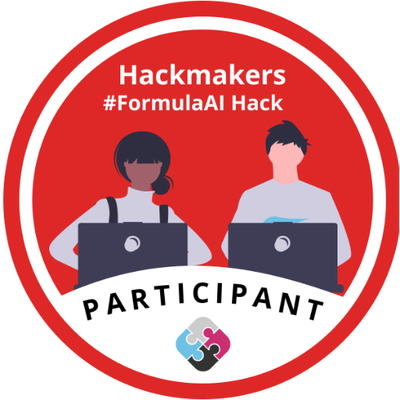

# Paweł Saniewski

**Bachelor of Computer Science** | **Software Engineer**

[![GitHub][101]][1]
[![LinkedIn][102]][2]
[![Visitors][103]][3]

|About Me||
|-|-|
|**Info:**|Male, 23 years old, Poland/USA|
|**Programming:**|[![C#][104]][4] [![.NET][105]][5] [![Mono][106]][6] [![Java][112]][12] [![Angular][107]][7] [![Vue.js][108]][8] [![JavaScript][109]][9] [![TypeScript][110]][10] [![Bash][111]][11]|
|**Analytics:**|[![Python][113]][13] [![SQL][114]][14] [![MS SQL Server][115]][15] [![Excel][116]][16]|
|**Management:**|[![Jira][117]][17] [![Confluence][118]][18] [![Git][119]][19] [![GanttProject][120]][20]|
|**Languages:**|[![English][121]][21] [![Polish][122]][22]|
|**:fire: Open Source:**|[![Zorin OS][123]][23] [![Debian][124]][24]|

  

## Certifications & Awards

 

### Open Data Addathon 2021
 

 

### FormulaAI Hack 2022

[1]: https://github.com/Saniewski/Saniewski
[2]: https://www.linkedin.com/in/pawelsaniewski
[3]: https://github.com/Saniewski/Saniewski
[4]: https://github.com/Saniewski/Saniewski
[5]: https://github.com/Saniewski/Saniewski
[6]: https://github.com/Saniewski/Saniewski
[7]: https://github.com/Saniewski/Saniewski
[8]: https://github.com/Saniewski/Saniewski
[9]: https://github.com/Saniewski/Saniewski
[10]: https://github.com/Saniewski/Saniewski
[11]: https://github.com/Saniewski/Saniewski
[12]: https://github.com/Saniewski/Saniewski
[13]: https://github.com/Saniewski/Saniewski
[14]: https://github.com/Saniewski/Saniewski
[15]: https://github.com/Saniewski/Saniewski
[16]: https://github.com/Saniewski/Saniewski
[17]: https://github.com/Saniewski/Saniewski
[18]: https://github.com/Saniewski/Saniewski
[19]: https://github.com/Saniewski/Saniewski
[20]: https://github.com/Saniewski/Saniewski
[21]: https://github.com/Saniewski/Saniewski
[22]: https://github.com/Saniewski/Saniewski
[23]: https://zorin.com/os
[24]: https://debian.com

[101]: https://img.shields.io/github/followers/Saniewski?style=social
[102]: https://img.shields.io/badge/LinkedIn-350+-0077B5?style=social&logo=linkedin
[103]: https://api.visitorbadge.io/api/visitors?path=https%3A%2F%2Fgithub.com%2FSaniewski&labelColor=%231f2833&countColor=%2345a29e&style=plastic
[104]: https://img.shields.io/badge/C%23-239120?style=plastic&logo=c-sharp&logoColor=white
[105]: https://img.shields.io/badge/.NET-512BD4?style=plastic&logo=dotnet&logoColor=white
[106]: https://img.shields.io/badge/Mono-5c7280?style=plastic
[107]: https://img.shields.io/badge/Angular-DD0031?style=plastic&logo=angular&logoColor=white
[108]: https://img.shields.io/badge/Vue.js-4FC08D?style=plastic&logo=vuedotjs&logoColor=white
[109]: https://img.shields.io/badge/JavaScript-F7DF1E?style=plastic&logo=javascript&logoColor=white
[110]: https://img.shields.io/badge/TypeScript-3178C6?style=plastic&logo=typescript&logoColor=white
[111]: https://img.shields.io/badge/Bash-4EAA25?style=plastic&logo=gnubash&logoColor=white
[112]: https://img.shields.io/badge/Java-dc2c00?style=plastic&logo=java&logoColor=white
[113]: https://img.shields.io/badge/Python-3776AB?style=plastic&logo=python&logoColor=white
[114]: https://img.shields.io/badge/MySQL-4479A1?style=plastic&logo=mysql&logoColor=white
[115]: https://img.shields.io/badge/MS%20SQL%20Server-CC2927?style=plastic&logo=microsoftsqlserver&logoColor=white
[116]: https://img.shields.io/badge/Excel-217346?style=plastic&logo=microsoftexcel&logoColor=white
[117]: https://img.shields.io/badge/Jira-0052CC?style=plastic&logo=jira&logoColor=white
[118]: https://img.shields.io/badge/Confluence-172B4D?style=plastic&logo=confluence&logoColor=white
[119]: https://img.shields.io/badge/Git-F05032?style=plastic&logo=git&logoColor=white
[120]: https://img.shields.io/badge/GanttProject-424242?style=plastic
[121]: https://img.shields.io/badge/English-C1-FFF?style=plastic&color=CC2927&labelColor=0052CC
[122]: https://img.shields.io/badge/Polish-native-FFF?style=plastic&color=CC2927&labelColor=FFF
[123]: https://img.shields.io/badge/Zorin%20OS-FFF?style=plastic&logo=zorin
[124]: https://img.shields.io/badge/Debian-A81D33?style=plastic&logo=debian&logoColor=white
